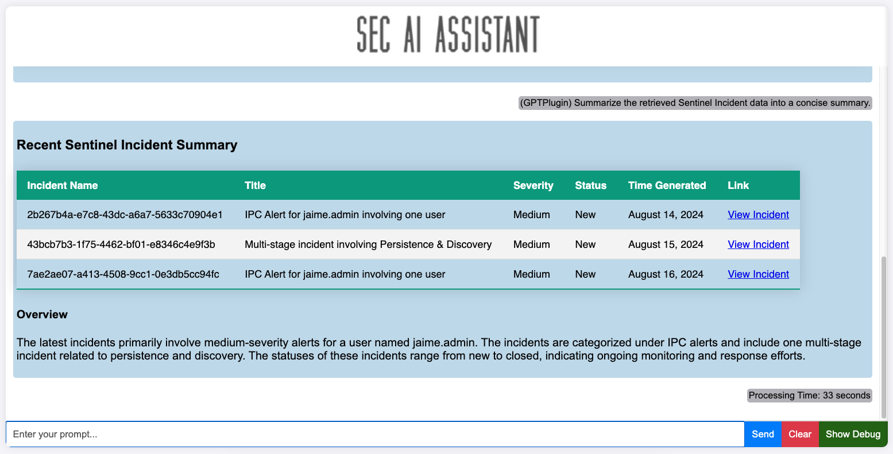
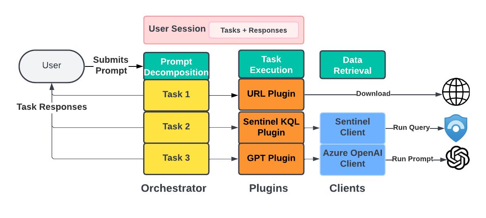
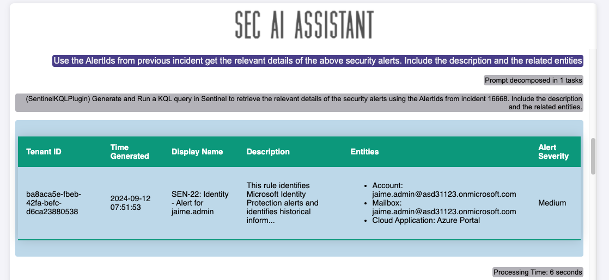
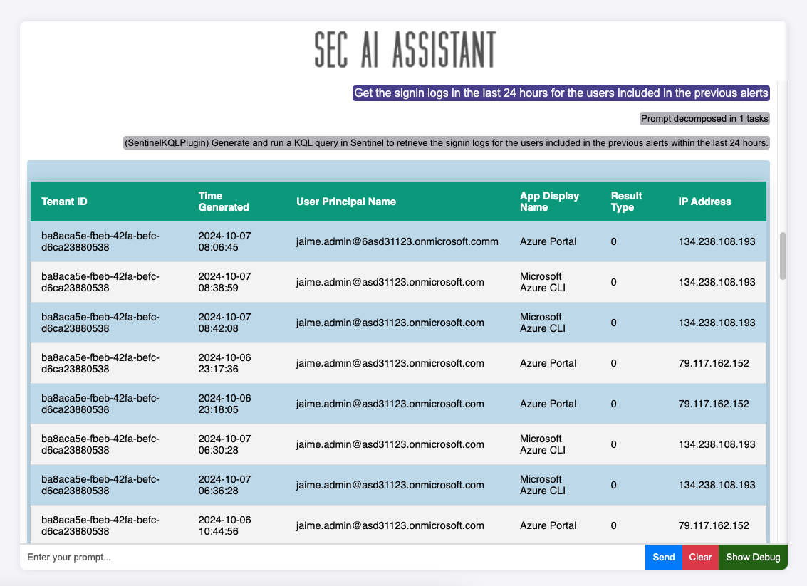
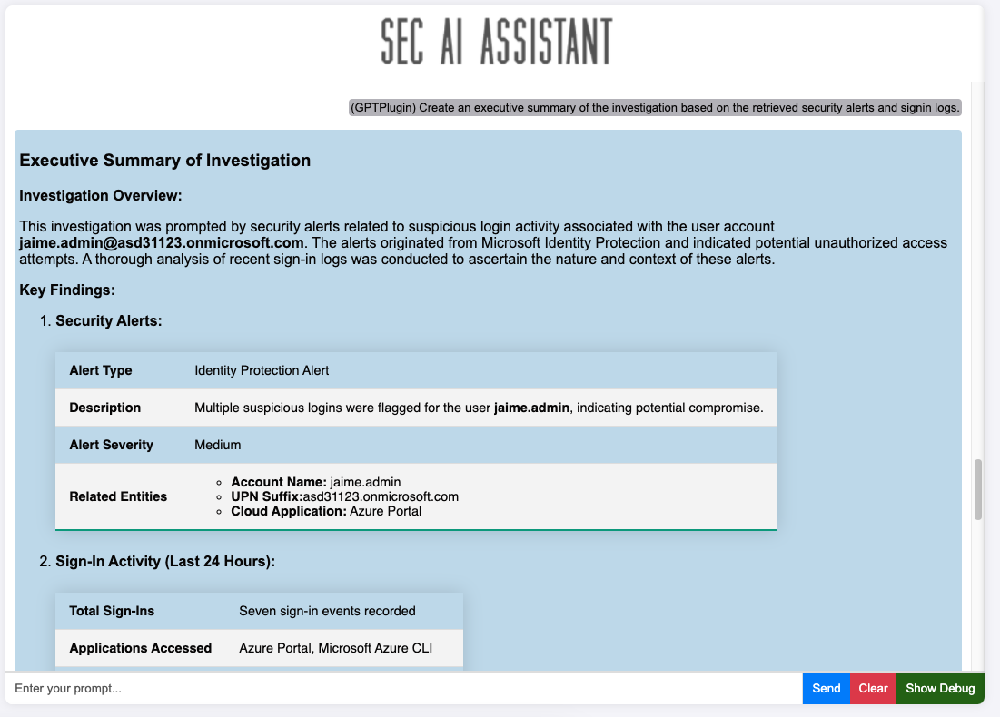

# SEC AI Assistant  
  
SEC AI Assistant is a Python-based AI assistant designed to interact with Security Solutions (currently only Microsoft Sentinel), fetch and process public URL data, and process the data and generate responses using LLMs (currently Azure OpenAI GPT models). This assistant can be used from the terminal or from a web interface. It supports different authentication methods.  
The goal of this project is to evaluate the usage and limits of using AI as part of Security Operations.
Currently its implemented to be run locally and by one user at a time. All the prompts run in the same session. 

## Disclaimer
- Please be aware that using this tool will generate costs on your Azure OpenAI instance. It's important to monitor your usage to avoid unexpected charges. The more data that is processes by the LLM the higher the cost. See Sentinel plugin description below to understand possible cost increases. 
- This tool does not incorporate any security measures. It is essential to understand that any data entered into the tool is not protected. Avoid using real or sensitive data, and ensure that you take necessary precautions to safeguard your information.
- This tool is designed solely for research and testing purposes and is not suited for production environments. It has not undergone rigorous testing or optimization for live deployment. Use it at your own risk, and be prepared for potential instability or issues.
## Main Features  
These are the main features of the tool:  
- Prompt decomposition in multiple tasks.
- Extensible with custom plugins and clients to connect to different platforms. 
- Authenticate to azure using different credentials type.  
- Fetch and process data from public URLs.  
- Generate responses using Azure OpenAI GPT models.  
- Session context for better interaction and use previous results in new prompts.  
## How it works
Every time the user submits a prompt the tool executes this steps:
- Prompt is decompsed in one or multiple sub-prompts (tasks) depending on its complexity. 
- For each task the tool will select the most appropriate plugin between the available ones and create the propmpt for this subtask.
- Each task will will be executed by selected plugin. Plugins can make use of the different clients to retrieve data from external platforms/sites and use the LLM to process the prompt (ie. Select the Sentinel table and generate a KQL to be run). 
- Response processing: Once the plugin sends back the response the underneatch LLM is used to produce a response using the data and the session context in the right format (terminal output/HTML)


## Current plugins  
  
- GPT: Run prompts using Azure OpenAi client. It uses the previous prompts and responses as context.
- Sentinel KQL: 
    - Generate and run KQL queries in your Sentinel instance. It uses available tables and actual Sentinel Schema to generate valid KQL queries. Currently KQL queries with only one table are generated. 
    - This plugin will use Azure OpenAI to create an extended Sentinel Schema. THe first time the tool is executed It runs a prompt for each table with 3 sample log entries to extract the table description and the most relevant fields. This task will be perfomed only the first time the tool is run. If you want to avoid this cost and not use the Sentinel Schema feature
- FetchURL: Fetch and process data from public URLs. The plugin logic removes unnecesary code (Javascript and CSS) from the downloaded site to reduce token consumption.

## Future improvements
- Better Session management (sumarization to reduce the tokens)
- Generate KQL queries with multiple tables
- Retry failed prompts/queries 
- Multiuser/mutisession
- Additional plugins (Graph API / Defender XDR)
  
## Sample prompts    
Below you can find some prompts inside a session:
### Incident Investigation
`Show me the list incidents with status New in Sentinel for the last 30 days. Show me the incident number, title and severity. Make sure you only show me the last entry for each incident.`
`Show me main details of the last instance of incident number XXXXX. Limit the results to 6 more important fields and include the list related of Alert IDs`
`Use the AlertIds from previous incident get the relevant details of the above security alerts. Include the description and the related entities`
`Get the signin logs in the last 24 hours for the users included in the previous alerts`
`Produce an Executive Summary of the investigated incident` 



### URL Fetching and processing
`Use this url to create a detection for AD object deletion https://attack.mitre.org/datasources/DS0026/#Active%20Directory%20Object%20Deletion in Sentinel`
`I need to craft a Sentinel Analytic Rule to detect the behaviour describe above. Generate the Sentinel Analytic rule to be deployed as an ARM template. Produce the output in json format`
`Fetch this url https://learn.microsoft.com/en-us/azure/azure-monitor/logs/query-optimization and optimize the query of the above Sentinel Analytic rule`


## Setup  
  
### Prerequisites  
  
- Python 3.6 or higher  
- `pip` (Python package installer)  
- Azure OpenAI GPT model (Endpoint URL and API Key)
- Microsoft Sentinel instance details (for Sentinel Plugin)
- Azure credentials (Interactive, Client Secret, or Managed Indentity)  

  
### Installation  
  
1. **Clone the repository:**  
    ```bash  
    git clone https://github.com/jguimera/SecAIAssistant.git  
    cd SecAIAssistant
    ```  
  
2. **Create and activate a virtual environment (optional but recommended):**  
    ```bash  
    python -m venv venv  
    source venv/bin/activate  # On Windows use `venv\Scripts\activate`  
    ```  
  
3. **Install the required packages:**  
    ```bash  
    pip install -r requirements.txt  
    ```  
  
4. **Set up environment variables:**  
    Create a `.env` file in the root directory and add the necessary environment variables or rename and update file `.env_sample`:  
    ```env
    #App Reg details for Authentication  
    AZURE_TENANT_ID=your-azure-tenant-id  
    AZURE_CLIENT_ID=your-azure-client-id  
    AZURE_CLIENT_SECRET=your-azure-client-secret  
    #Sentinel Details
    AZURE_SUBSCRIPTION_ID=your-azure-subscription-id  
    AZURE_RESOURCEGROUP_NAME=your-azure-resource-group-name  
    AZURE_WORKSPACE_NAME=your-azure-workspace-name  
    AZURE_WORKSPACE_ID=your-azure-workspace-id
    #Azure Open AI details  
    AZURE_OPENAI_ENDPOINT=your-azure-openai-endpoint  
    AZURE_OPENAI_APIKEY=your-azure-openai-apikey  
    AZURE_OPENAI_MODELNAME=your-azure-openai-modelname  
    ASSISTANT_CONTEXT_WINDOW_SIZE=5  
    #Plugins Config
    #Enable Sentinel Schema generation for enchance KQL generation. Use String value
    SENTINELKQL_LOADSCHEMA="True"
    ```  
  
## Usage  
  
### Running the Assistant  
  
To run the SEC AI Assistant, use one of the `run*.py` scripts. Currently you can run the tool for Terminal interface `runTerminal.py` or via Web`runWeb.py` You can choose the authentication method (`interactive`, `client_secret`, or `default`) by providing it as an argument.  
  
```bash  
python runTerminal.py [auth]  
```

For example, to run Web with interactive authentication:

```bash  
python runWeb.py interactive  
```
A browser window will be open to login as an Entra ID user. 

## Project Structure
 
- runWeb.py: Script to run the assistant from the web browser.
- runTerminal.py: Script to run the assistant from the terminal.
- app/SecAIAssistant.py: Main class implementing the assistant functionalities.
- app/HelperFunctions.py: Helper functions for logging and printing messages.
- app/clients/: Directory containing client classes for interacting with Azure services.Plugins will use these clients. 
- app/plugins/: Directory containing plugin classes for various functionalities.
- webapp/: Directory containing Flask website files (Routes, Temaplates, Statics).


## Extending the platform

You can build your own clients and custom plugins by extending the SECAIAssistanPlugin class and adding your plugin to the project structure. See plugins README for more details. 
Currently you need to manually add the custom plugin instantiation to the main SecAIAssistant class (load_plugins method)

## Contributing
 
Contributions are welcome! Please fork the repository and submit a pull request for any enhancements or bug fixes.
## License 
This project is licensed under the MIT License. See the LICENSE file for more details.