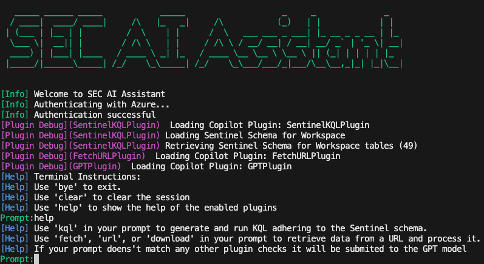
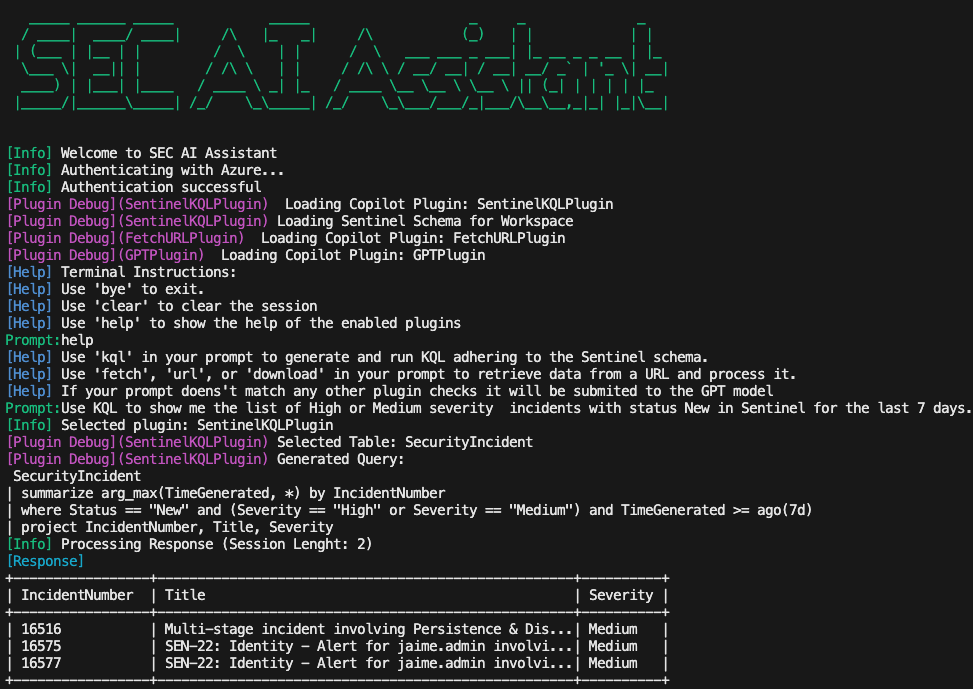
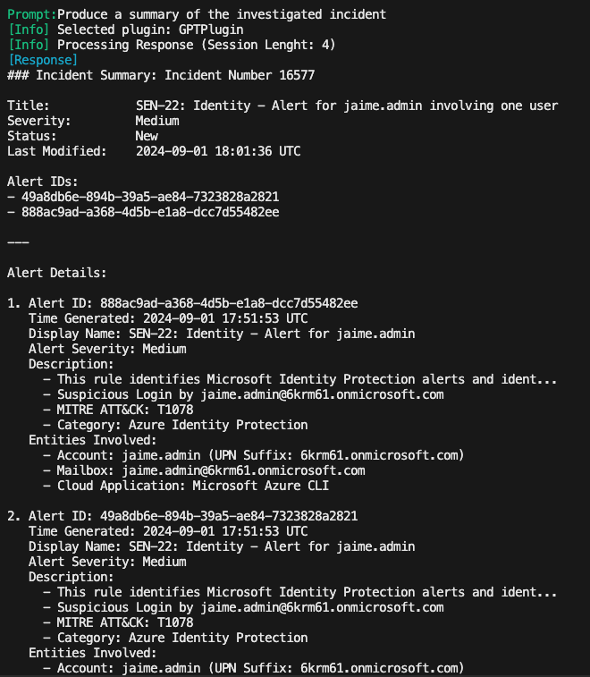
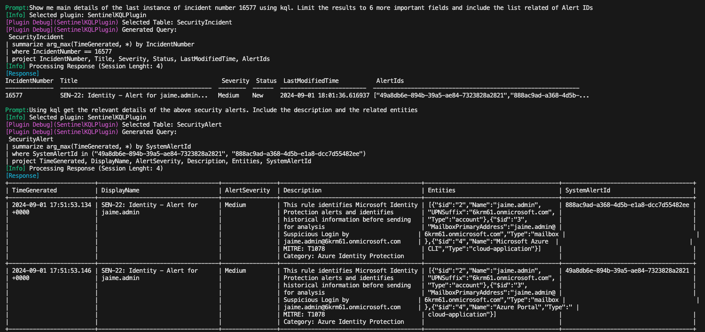
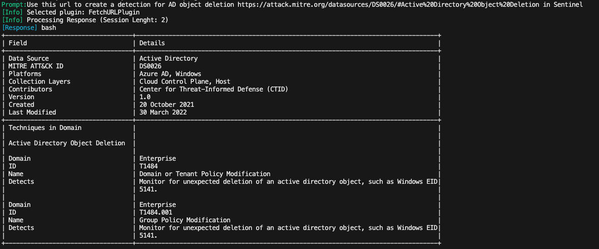
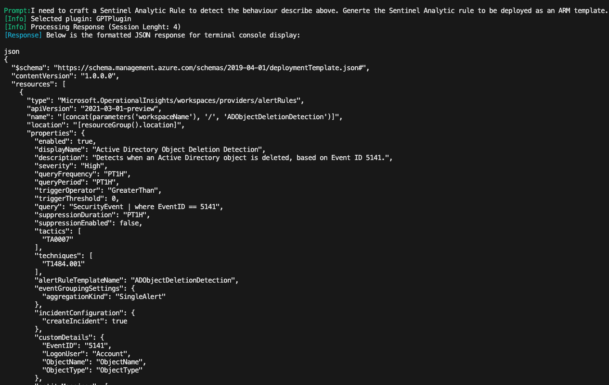

# SEC AI Assistant  
  
SEC AI Assistant is a Python-based AI assistant designed to interact with various Azure services, fetch and process public URL data, and generate responses using Azure OpenAI GPT models. This assistant can be run in a terminal and supports different authentication methods.  
The goal of this project is to evaluate the usage and limits of using AI as part of Security Operations. This tool will allow you to fetch data from Security Platforms and public facing websites and run LLM prompts on top of it. 
Currently it is available to be used from a terminal and the reponses are formated to be Terminal-friendly by the underlaying LLM. It can be extended to be used from a Web interface via REST API. 


## Main Features  
These are the main features of the tool:  
- Authenticate using different Azure credentials.  
- Extensible with custom plugins to connect to different platforms.  
- Fetch and process data from public URLs.  
- Generate responses using Azure OpenAI GPT models.  
- Session context for better interaction and use previous results in new prompts.  
## How it works
Every time the user submits a prompt the tool executes this steps: 
- Plugin selection: This is currently done by looking por specific strings inside the prompt. Each plugin has these strings inside its definition and the first one with a match is selected. 
- Prompt execution: The current session and the prompt is sent to the plugin. Each plugin will process the inputs in its own way. Plugins can make use of the different clients to retrieve data from external platforms/sites and use the LLM to process the prompt (ie. Select the Sentinel table and generate a KQL to be run). 
- Response processing: Once the plugin sends back the response the underneatch LLM is used to produce a response using the data and the session context in the right format (terminal output)

## Current plugins  
  
- GPT: Run prompts using Azure OpenAi client. 
- Sentinel KQL: Generate and run KQL queries in your Sentinel instance. It uses available tables and actual Sentinel Schema to generate valid KQL queries. Currently KQL queries with only one table are generated. 
- FetchURL: Fetch and process data from public URLs.

## Sample prompts    
Below you can find some prompts inside a session:
### Incident Investigation
`Use KQL to show me the list of High or Medium severity  incidents with status New in Sentinel for the last 7 days. Show me the incident number, title and severity. Make sure you only show me the last entry for each incident.`
`Show me main details of the last instance of incident number XXXX using kql. Limit the results to 6 more important fields and include the list related of Alert IDs`
`Using kql get the relevant details of the above security alerts. Include the description and the related entities`
`Produce a summary of the investigated incident` 



### URL Fetching and processing
`Use this url to create a detection for AD object deletion https://attack.mitre.org/datasources/DS0026/#Active%20Directory%20Object%20Deletion in Sentinel`
`I need to craft a Sentinel Analytic Rule to detect the behaviour describe above. Generate the Sentinel Analytic rule to be deployed as an ARM template. Produce the output in json format`
`Fetch this url https://learn.microsoft.com/en-us/azure/azure-monitor/logs/query-optimization and optimize the query of the above Sentinel Analytic rule`



## Setup  
  
### Prerequisites  
  
- Python 3.6 or higher  
- `pip` (Python package installer)  
- Azure OpenAI GPT model (Endpoint URL and API Key)
- Microsoft Sentinel instance details (for Sentinel Plugin)
- Azure credentials (Interactive, Client Secret, or Managed Indentity)  

  
### Installation  
  
1. **Clone the repository:**  
    ```bash  
    git clone https://github.com/jguimera/SecAIAssistant.git  
    cd SecAIAssistant
    ```  
  
2. **Create and activate a virtual environment (optional but recommended):**  
    ```bash  
    python -m venv venv  
    source venv/bin/activate  # On Windows use `venv\Scripts\activate`  
    ```  
  
3. **Install the required packages:**  
    ```bash  
    pip install -r requirements.txt  
    ```  
  
4. **Set up environment variables:**  
    Create a `.env` file in the root directory and add the necessary environment variables or rename and update file `.env_sample`:  
    ```env
    #App Reg details for Authentication  
    AZURE_TENANT_ID=your-azure-tenant-id  
    AZURE_CLIENT_ID=your-azure-client-id  
    AZURE_CLIENT_SECRET=your-azure-client-secret  
    #Sentinel Details
    AZURE_SUBSCRIPTION_ID=your-azure-subscription-id  
    AZURE_RESOURCEGROUP_NAME=your-azure-resource-group-name  
    AZURE_WORKSPACE_NAME=your-azure-workspace-name  
    AZURE_WORKSPACE_ID=your-azure-workspace-id
    #Azure Open AI details  
    AZURE_OPENAI_ENDPOINT=your-azure-openai-endpoint  
    AZURE_OPENAI_APIKEY=your-azure-openai-apikey  
    AZURE_OPENAI_MODELNAME=your-azure-openai-modelname  
    ASSISTANT_CONTEXT_WINDOW_SIZE=5  
    ```  
  
## Usage  
  
### Running the Assistant  
  
To run the SEC AI Assistant, use the `run.py` script. You can choose the authentication method (`interactive`, `client_secret`, or `default`) by providing it as an argument.  
  
```bash  
python run.py [auth]  
```

For example, to run with interactive authentication:

```bash  
python run.py interactive  
```
A browser window will be open to login as an Entra ID user. 

### Terminal Instructions
You can type your prompt directly into the terminal. 
There are some predefined shortcuts:
- Exit the assistant: Type `bye`
- Clear the session: Type `clear`
- Get plugin help: Type `help`
Each plugin will look for specific strings in the prompt to execute the request. 
Current plugins will look fo these strings in the prompt:
- KQL Query generation and execution in Sentinel: Include  `KQL` or   `query` in your prompt.
- Fetch and process public URL data: Include `URL` or `Fetch` in your prompt
 

## Project Structure
 
- SecAIAssistant.py: Main class implementing the assistant functionalities.
- run.py: Script to run the assistant from the terminal.
- clients/: Directory containing client classes for interacting with Azure services.Plugins will use these clients. 
- plugins/: Directory containing plugin classes for various functionalities.
- HelperFunctions.py: Helper functions for logging and printing messages.

## Extending the platform

You can build your own custom plugins by extending the SECAIAssistanPlugin class and adding your plugin to the project structure. See plugins README for more details. 
Currently you need to manually add the custom plugin instantiation to the main SecAIAssistant class (load_plugins method)

## Contributing
 
Contributions are welcome! Please fork the repository and submit a pull request for any enhancements or bug fixes.
## License 
This project is licensed under the MIT License. See the LICENSE file for more details.